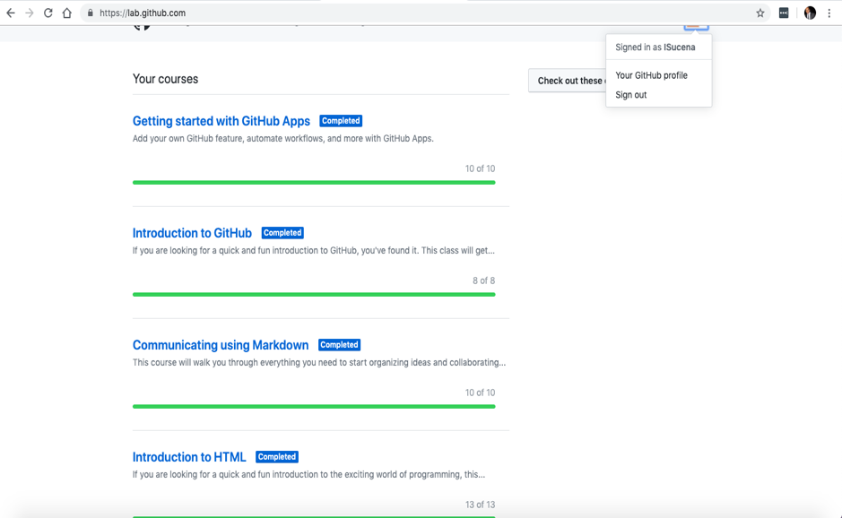
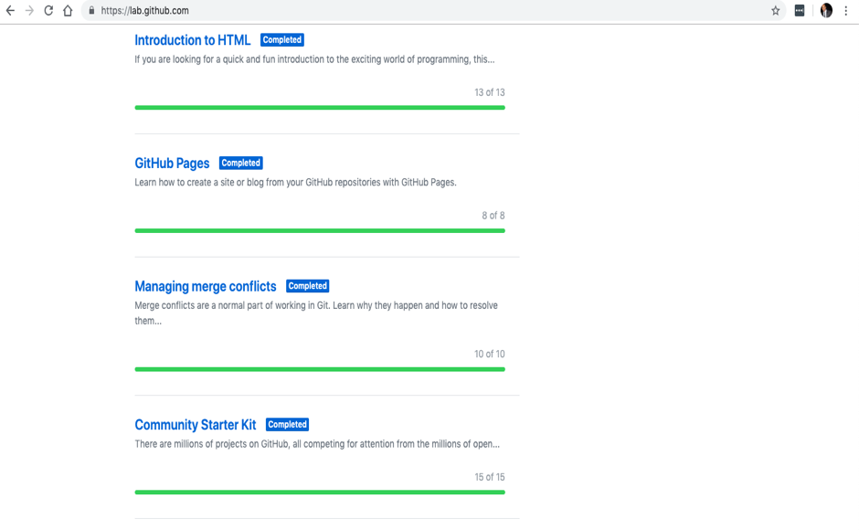
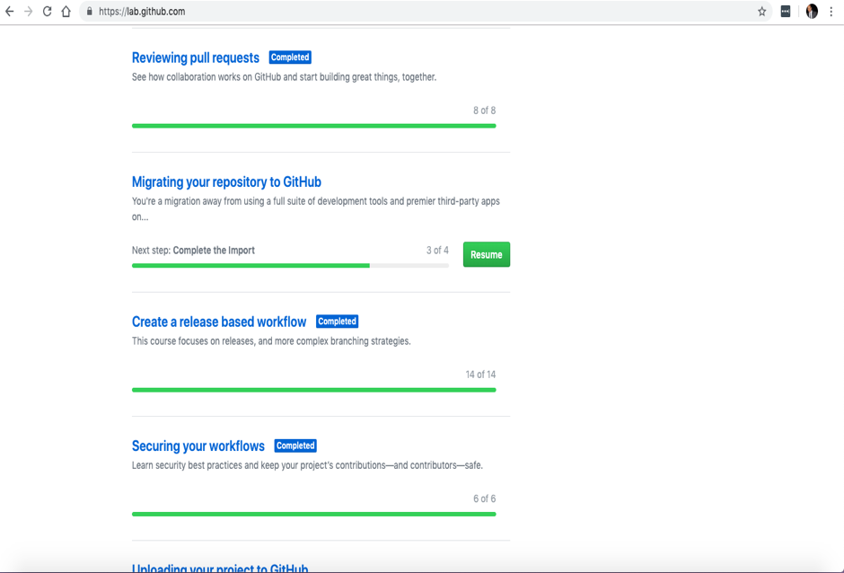
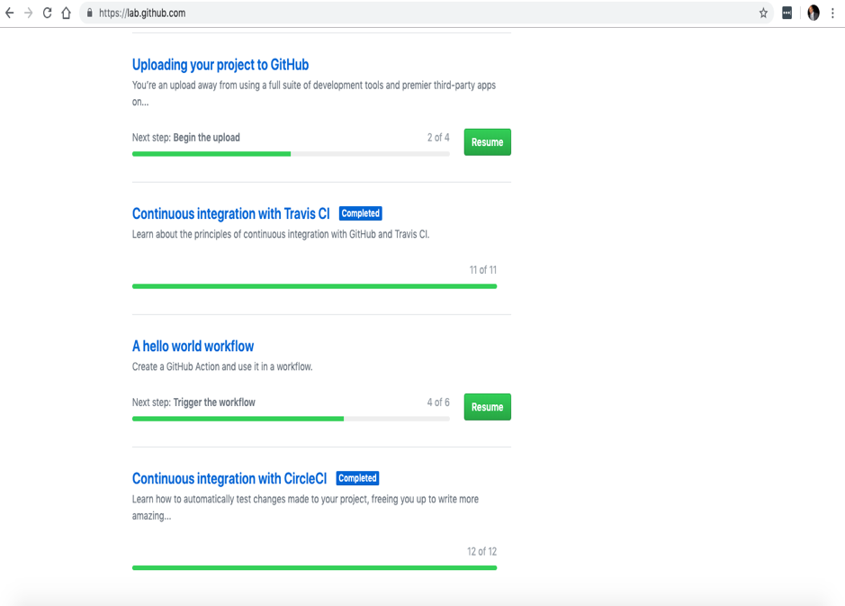
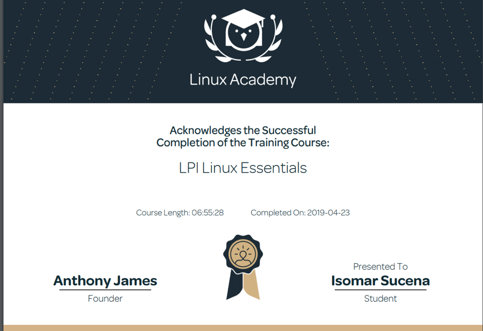
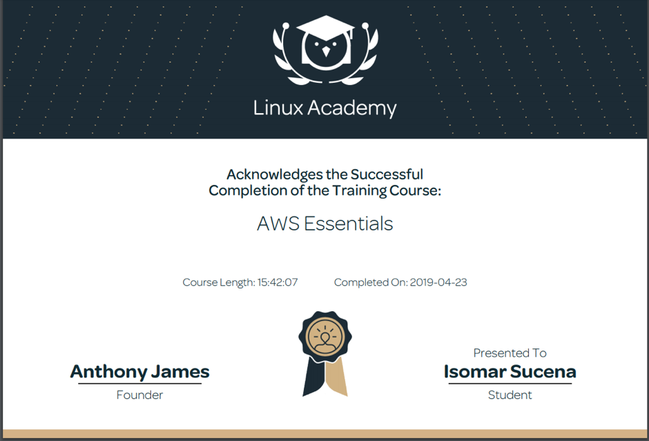

## TechSkillsResume

Here are the Technical skills that I have aquired through the "CIS: Tech Skills and Certification" course.

<h2> Tech Skills aquired </h2>
  

GitHub
  
 <h4> Description: </h4>
  This is the proof of completion of the gitHub learning lab courses. The website provides a walkthrough process with very clear steps and descriptions that teaches you how to work with github. 
 
 
<ul>
There were 13 lab courses on gitHub page, which I completed 10 of them but I got stuck on 3 of them.
  <li>Getting started with GitHub Apps</li>
  <li>Introduction to gitHub</li>
  <li>Communicating using Markdown</li>
  <li>Introduction to HTML</li>
  <li>GitHub Pages</li>
  <li>Managing Merge Conflicts</li>
  <li>Community Starter Kit</li>
  <li>Reviewing Pull Requests</li>
  <li>Migrating your repository to GitHub</li>
  <li>Creating a release bases workflow</li>
  <li>Securing your workflows</li>
  <li>Uploading Your Project to GitHub</li>
  <li>Continuous Integration with Travis CI</li>   
  <li>A Hello World Workflow</li>
  
</ul>

<h4> Completed Course Screenshots: </h4>

  

  
   

LPI Essentials by Linux Academy

  <h4> Description: </h4>
  The LPI Essentials is an online training offered on the Linux Academy <a href="https://www.linuxacademy.com">website.</a> The training provide videos, and quizzes that teaches you the basic and most essential consepts and fuctions of linux. The training also provides the history of Linux includind the criation and the creators, and explains how it all started. 
 
 
  
  <h4> Completed Course: </h4>

   

   
    

AWS Essentials by Lininux academy

  <h4> Description: </h4>
  I completed the AWS Essentials online training offered by Linux Academy. The course provides videos, lab work, and quizzes that teaches you the basic consepts and fuctions of Amazon Web Services. The videos in the course provide clear lectures on how AWS works, and what are the important features provided by AWS.  
 
 
<ul>
Trainings provided:
  <li>Managing AWS Access with Users, Groups, and Roles</li>
  <li>Networking Services and Connectivity</li>
  <li>Compute Services</li>
  <li>Storage Services</li>
  <li>Database Services</li>
  <li>Monitoring, Alerts, and Notifications</li>
  <li>Load Balancing, Elasticity, and Scalability</li>
  <li>Serverless Computing</li>
</ul>
  
   I completed the AWS Essentials Course by Linux Academy.
  
  <h4> Completed Course: </h4>

   

    
